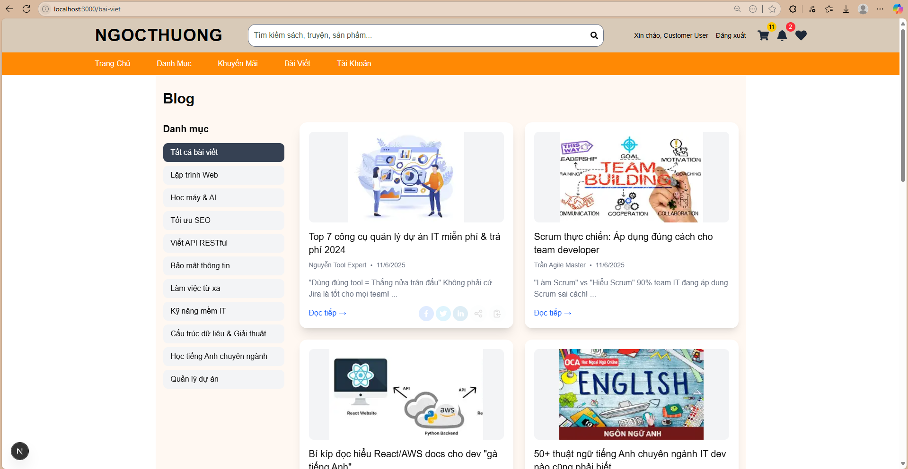
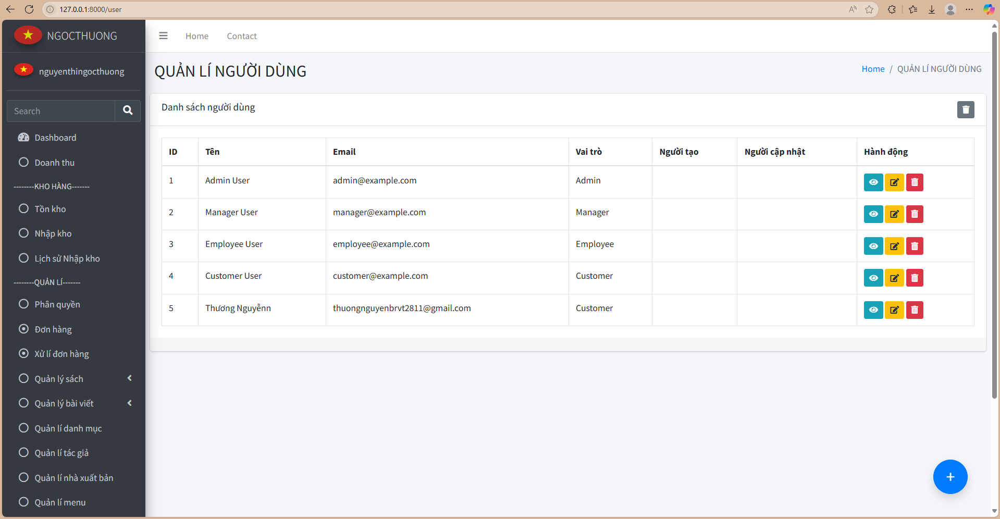

This is a [Next.js](https://nextjs.org) project bootstrapped with [`create-next-app`](https://nextjs.org/docs/app/api-reference/cli/create-next-app).

## 🖥️ (demo) Giao diện người dùng




## ⚙️ (demo) Giao diện admin



## 📦 Tính năng chính

    Trang chủ
    Trang đăng nhập/đăng ký
    Trang quản lý (Admin Dashboard)
    Trang danh sách sản phẩm theo danh mục
    Trang chi tiết sản phẩm
    Trang giỏ hàng
    Trang thanh toán
    Trang người dùng (User Profile)
    Trang thông báo
    Trang đánh giá sản phẩm
    Trang bài viết
    Trang chi tiết bài viết
    Trang khuyến mãi
    Trang tạo đơn (nhân viên)

## Getting Started

First, run the development server:

```bash
npm run dev
# or
yarn dev
# or
pnpm dev
# or
bun dev
```

Open [http://localhost:3000](http://localhost:3000) with your browser to see the result.

You can start editing the page by modifying `app/page.tsx`. The page auto-updates as you edit the file.

This project uses [`next/font`](https://nextjs.org/docs/app/building-your-application/optimizing/fonts) to automatically optimize and load [Geist](https://vercel.com/font), a new font family for Vercel.

## Learn More

To learn more about Next.js, take a look at the following resources:

- [Next.js Documentation](https://nextjs.org/docs) - learn about Next.js features and API.
- [Learn Next.js](https://nextjs.org/learn) - an interactive Next.js tutorial.

You can check out [the Next.js GitHub repository](https://github.com/vercel/next.js) - your feedback and contributions are welcome!

## Deploy on Vercel

The easiest way to deploy your Next.js app is to use the [Vercel Platform](https://vercel.com/new?utm_medium=default-template&filter=next.js&utm_source=create-next-app&utm_campaign=create-next-app-readme) from the creators of Next.js.

Check out our [Next.js deployment documentation](https://nextjs.org/docs/app/building-your-application/deploying) for more details.
